# Low Vision Accessibility Extension - Design & Development Documentation

## Table of Contents
1. [Overview](#overview)
2. [Architecture Design](#architecture-design)
3. [Development Phases](#development-phases)
4. [Component Workflows](#component-workflows)
5. [Build System](#build-system)
6. [Extension Lifecycle](#extension-lifecycle)
7. [Technical Implementation Details](#technical-implementation-details)

---

## Overview

The **Low Vision Accessibility Extension** is a VS Code extension designed to enhance accessibility for developers with low vision. It combines:
- **9 High-Contrast Color Themes** (GitHub-based)
- **Atkinson Hyperlegible Mono Font** (optimized for readability)
- **Comprehensive Settings Panel** (Webview-based UI for easy configuration)

### Design Principles

1. **Accessibility First**: All features prioritize clarity, contrast, and usability
2. **Non-Intrusive**: Activates on startup but doesn't interfere with workflow
3. **Modular Architecture**: Themes, fonts, and settings are independently maintainable
4. **User-Friendly**: Provides recommended presets with one-click application

---

## Architecture Design

### High-Level Architecture

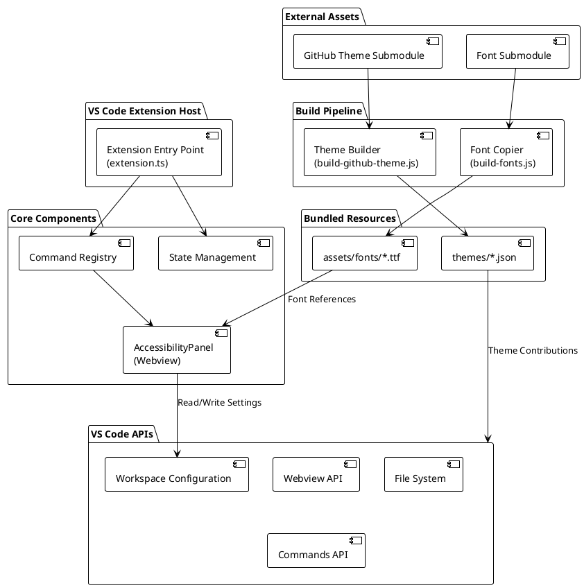

### Component Breakdown

| Component | Purpose | Technology |
|-----------|---------|------------|
| `extension.ts` | Extension activation, command registration, font installation prompt | TypeScript + VS Code API |
| `AccessibilityPanel.ts` | Webview-based settings UI with real-time config management | TypeScript + Webview API |
| `build-github-theme.js` | Automated theme generation from git submodule | Node.js Script |
| `build-fonts.js` | Font file copying from submodule to extension | Node.js Script |
| `themes/*.json` | Color theme definitions (9 variants) | JSON (VS Code Theme Format) |
| `assets/fonts/*.ttf` | Atkinson Hyperlegible Mono font files | TrueType Fonts |

---

## Development Phases

### Phase 1: Project Initialization & Setup

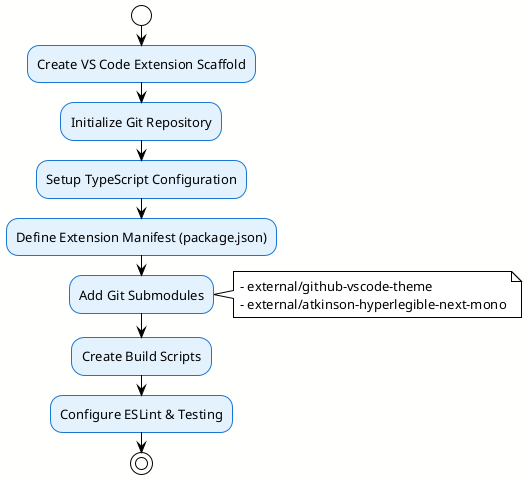

**Key Activities:**
1. **Scaffolding**: Used VS Code's `yo code` generator to create base structure
2. **Configuration**: Set up `tsconfig.json` for TypeScript compilation
3. **Dependencies**: Added `@types/vscode` and testing packages
4. **Submodules**: Linked external repositories for themes and fonts
5. **Package.json**: Defined activation events, commands, and theme contributions

### Phase 2: Theme Integration

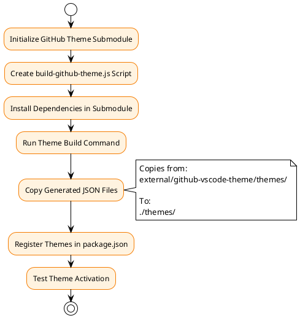

**Technical Details:**

The theme build script (`scripts/build-github-theme.js`) performs:
```javascript
// 1. Dependency Check & Installation
if (!fs.existsSync(path.join(repoPath, "node_modules"))) {
    run("npm ci", repoPath);  // Uses lockfile for reproducibility
}

// 2. Theme Compilation
run("npm run build", repoPath);  // Generates JSON from source

// 3. File Copy
copyThemes(distPath, outputPath);  // Moves to extension themes/
```

**Theme Registration Pattern:**
```json
{
  "label": "GitHub Dark High Contrast (Low Vision)",
  "uiTheme": "hc-black",  // Maps to VS Code theme type
  "path": "./themes/dark-high-contrast.json"
}
```

### Phase 3: Font Integration

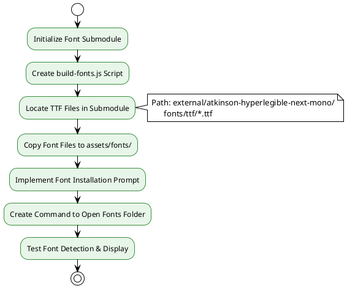

**Font Workflow:**

1. **Build-Time**: Fonts copied via `npm run build:fonts`
2. **Runtime**: Extension prompts user to install fonts on first activation
3. **User Action**: Double-click .ttf files in OS to install system-wide
4. **Configuration**: Settings panel allows selecting "Atkinson Hyperlegible Mono"

### Phase 4: Accessibility Settings Panel Development

This was the most complex phase, implementing a full-featured Webview UI.

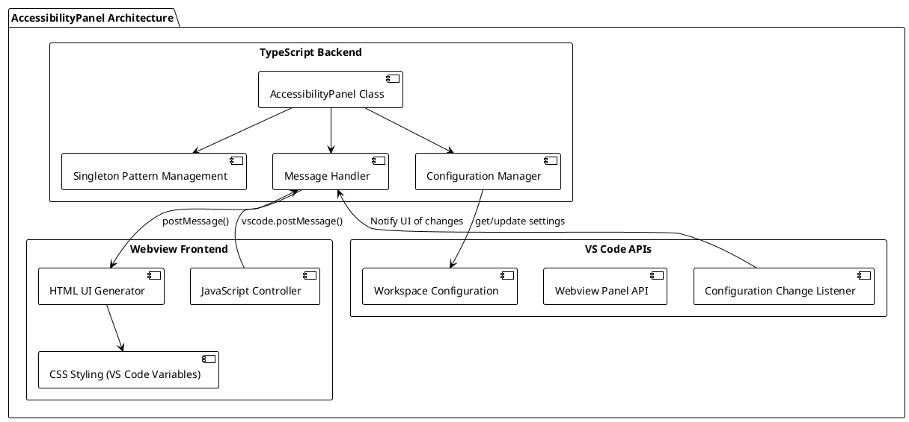

**Panel Features Implementation:**

| Feature | Implementation Approach |
|---------|------------------------|
| **Singleton Pattern** | `AccessibilityPanel.createOrShow()` reuses existing panel instance |
| **Real-time Updates** | `onDidChangeConfiguration` listener with 300ms debounce |
| **Settings Categories** | Quick Settings (15+) + Other Settings (15+) grouped by functionality |
| **Recommended Preset** | Hardcoded optimal low-vision settings applied via one button |
| **Reset Functionality** | Sets all settings to `undefined` to restore VS Code defaults |
| **Bidirectional Sync** | UI → Config → UI feedback loop prevents stale state |

**Settings Management Flow:**

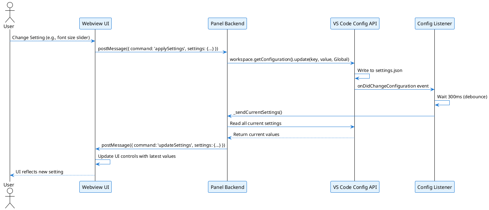

**Key Design Decision: Debouncing**

To prevent UI flicker when dragging sliders, a 300ms debounce timer delays UI refreshes:
```typescript
vscode.workspace.onDidChangeConfiguration(e => {
    if (this._configUpdateTimer) {
        clearTimeout(this._configUpdateTimer);
    }
    this._configUpdateTimer = setTimeout(() => {
        this._sendCurrentSettings();
    }, 300);
});
```

### Phase 5: Command Registration & Extension Activation

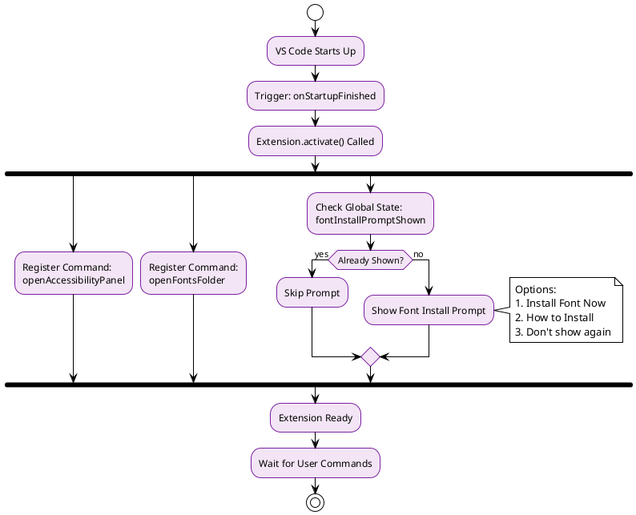

**Activation Flow Details:**

```typescript
export function activate(context: vscode.ExtensionContext) {
    // 1. Register Commands
    context.subscriptions.push(
        vscode.commands.registerCommand(
            'low-vision-accessibility.openAccessibilityPanel',
            () => AccessibilityPanel.createOrShow(context.extensionUri)
        )
    );
    
    // 2. Font Installation Prompt (One-time)
    maybePromptForFontInstall(context);
}
```

---

## Component Workflows

### 1. Extension Activation & Command Execution

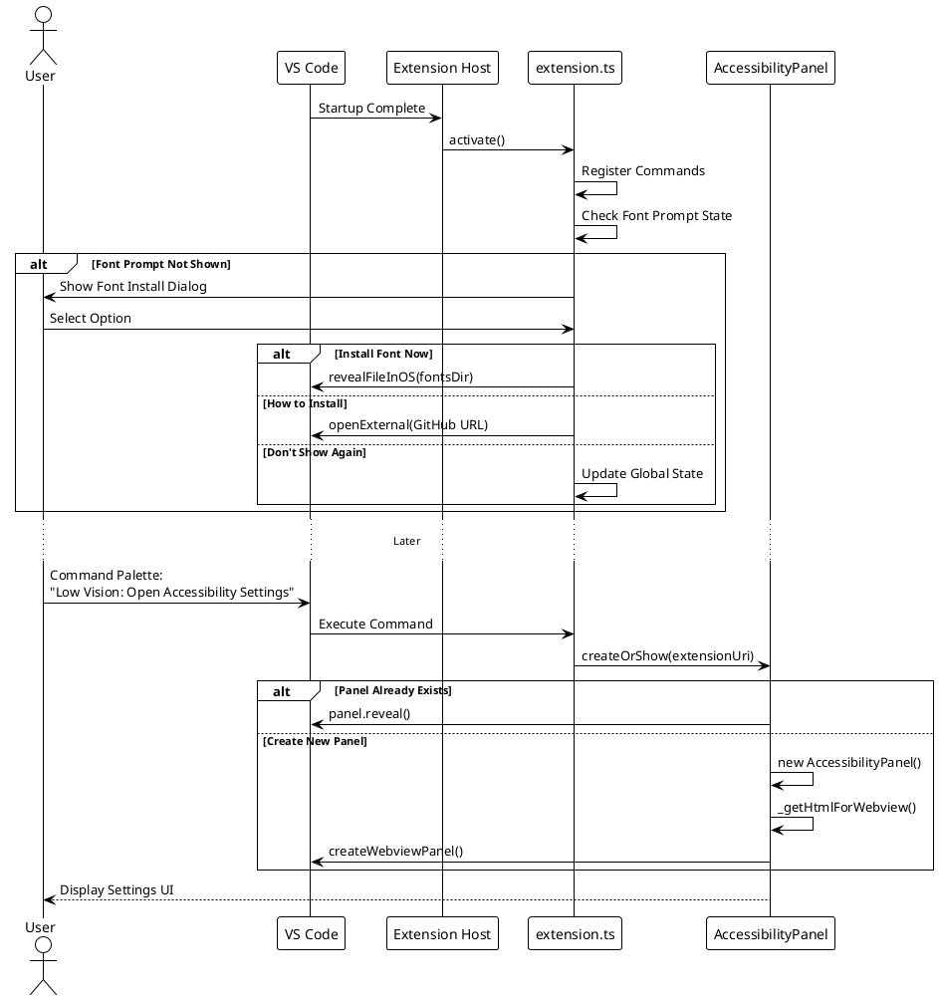

### 2. Settings Application Workflow

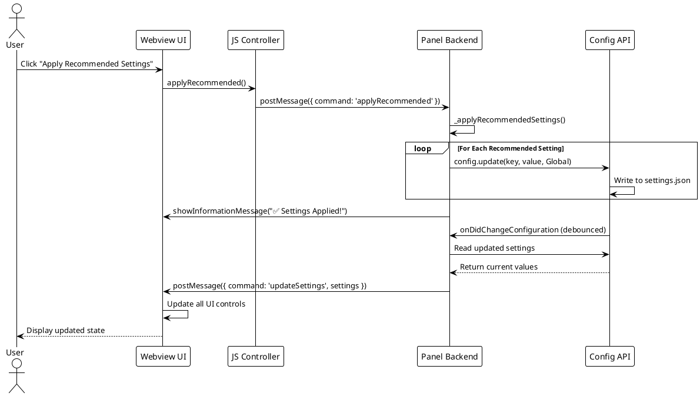

### 3. Theme Build Pipeline

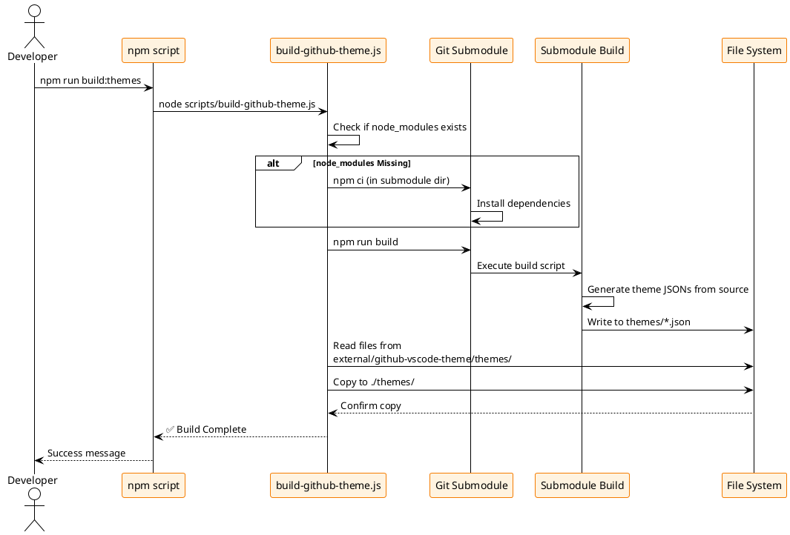

---

## Build System

### Build Process Overview

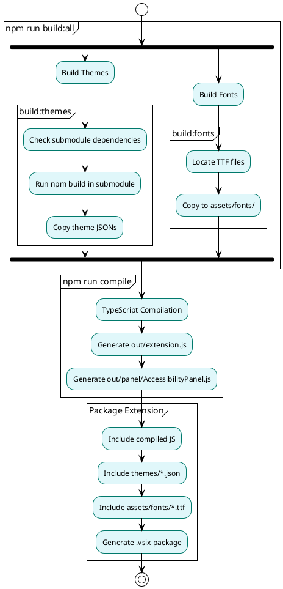

### Build Commands

| Command | Purpose | Output |
|---------|---------|--------|
| `npm run compile` | Compile TypeScript to JavaScript | `out/extension.js`, `out/panel/AccessibilityPanel.js` |
| `npm run watch` | Continuous compilation on file changes | Live updates in `out/` |
| `npm run build:themes` | Generate theme files from submodule | `themes/*.json` |
| `npm run build:fonts` | Copy font files from submodule | `assets/fonts/*.ttf` |
| `npm run build:all` | Build both themes and fonts | Combined output |
| `npm run lint` | Run ESLint on source files | Error/warning reports |
| `npm test` | Execute extension tests | Test results |

### Dependency Graph

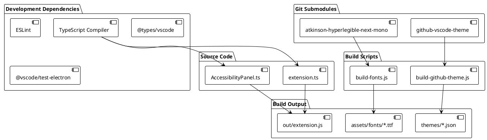

---

## Extension Lifecycle

### Complete Lifecycle Flow

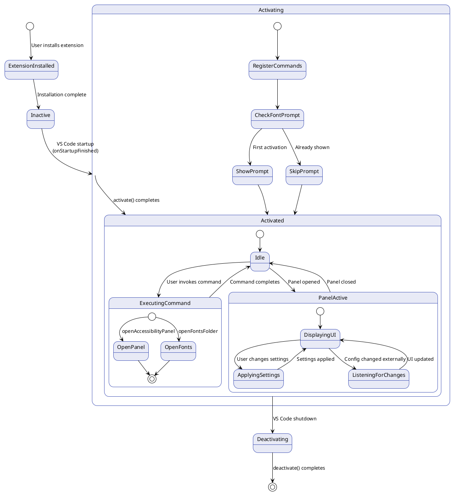

### State Transitions

| State | Trigger | Next State | Actions |
|-------|---------|------------|---------|
| **Installed** | VS Code Startup | Activating | Load extension code |
| **Activating** | `activate()` called | Activated | Register commands, show font prompt |
| **Activated** | User command | Executing | Process command logic |
| **Panel Active** | Settings changed | Panel Active | Update config, refresh UI |
| **Deactivating** | VS Code Shutdown | Inactive | Dispose resources |

---

## Technical Implementation Details

### 1. Singleton Pattern Implementation

**Purpose**: Ensure only one AccessibilityPanel instance exists at a time.

```typescript
export class AccessibilityPanel {
    public static currentPanel: AccessibilityPanel | undefined;
    
    public static createOrShow(extensionUri: vscode.Uri) {
        if (AccessibilityPanel.currentPanel) {
            // Reuse existing panel
            AccessibilityPanel.currentPanel._panel.reveal();
            return;
        }
        
        // Create new panel
        const panel = vscode.window.createWebviewPanel(
            'lowVisionAccessibility',
            'Low Vision Accessibility Settings',
            vscode.ViewColumn.One,
            { enableScripts: true, retainContextWhenHidden: true }
        );
        
        AccessibilityPanel.currentPanel = new AccessibilityPanel(panel, extensionUri);
    }
}
```

**Benefits**:
- Prevents multiple panels from conflicting
- Maintains state across panel reveals
- Reduces resource usage

### 2. Configuration Management Strategy

**Challenge**: Keep UI in sync with VS Code settings while avoiding race conditions.

**Solution**: Pending Updates Tracking

```typescript
// In Webview JavaScript
const pendingUpdates = {};

function applySetting(key, value) {
    pendingUpdates[key] = value;  // Mark as pending
    vscode.postMessage({
        command: 'applySettings',
        settings: { [key]: value }
    });
}

function updateUIWithSettings(settings) {
    for (const [key, value] of Object.entries(settings)) {
        if (pendingUpdates.hasOwnProperty(key)) {
            if (pendingUpdates[key] !== value) {
                continue;  // Skip stale value
            }
            delete pendingUpdates[key];  // Value matched, clear pending
        }
        // Update UI control
    }
}
```

**Flow Diagram**:

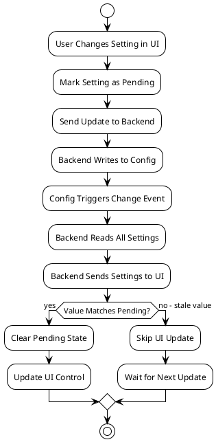

### 3. Webview Security & Resource Management

**Security Measures**:
- Content Security Policy enforced by VS Code
- No external script loading
- All resources loaded from extension URI

**Resource Management**:
```typescript
private constructor(panel: vscode.WebviewPanel, extensionUri: vscode.Uri) {
    this._panel = panel;
    
    // Dispose on panel close
    this._panel.onDidDispose(() => this.dispose(), null, this._disposables);
    
    // Clean up config listener
    vscode.workspace.onDidChangeConfiguration(
        e => { /* ... */ },
        null,
        this._disposables  // Auto-disposed with panel
    );
}

public dispose() {
    AccessibilityPanel.currentPanel = undefined;
    
    if (this._configUpdateTimer) {
        clearTimeout(this._configUpdateTimer);
    }
    
    this._panel.dispose();
    
    while (this._disposables.length) {
        this._disposables.pop()?.dispose();
    }
}
```

### 4. CSS Theming Integration

**Strategy**: Use VS Code CSS variables for seamless theme integration.

```css
body {
    font-family: var(--vscode-font-family);
    color: var(--vscode-foreground);
    background-color: var(--vscode-editor-background);
}

.btn-primary {
    background-color: var(--vscode-button-background);
    color: var(--vscode-button-foreground);
}

input[type="text"] {
    border: 1px solid var(--vscode-input-border);
    background-color: var(--vscode-input-background);
}
```

**Benefits**:
- Panel automatically adapts to user's chosen theme
- Maintains VS Code's visual consistency
- No hardcoded colors

### 5. Font Installation Workflow

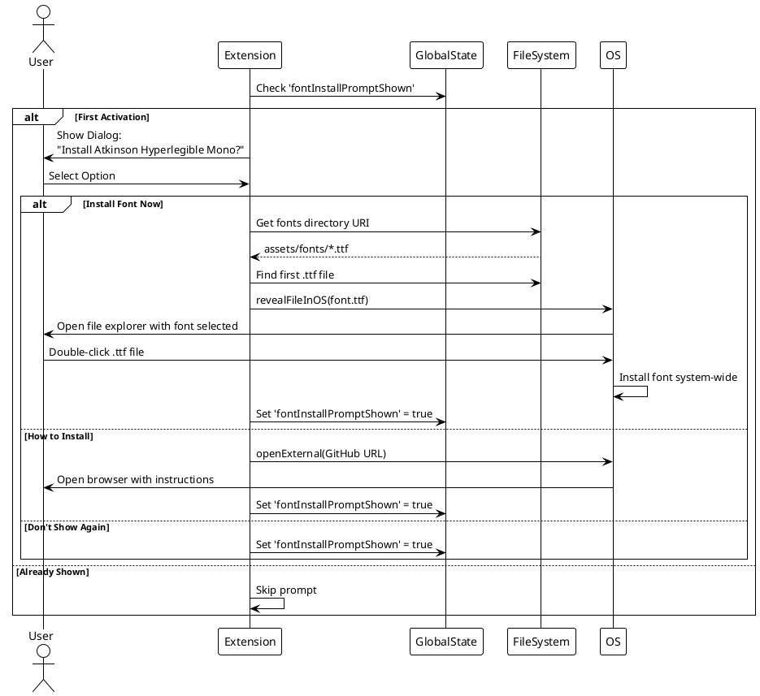

---

## Recommended Settings Configuration

The extension provides a carefully curated set of low-vision optimized settings:

### Recommended Preset Values

| Setting | Value | Rationale |
|---------|-------|-----------|
| `editor.fontFamily` | Atkinson Hyperlegible Mono | Designed for low vision readability |
| `editor.fontSize` | 16px | Larger than default (14px) for better visibility |
| `editor.mouseWheelZoom` | true | Quick zoom adjustment capability |
| `editor.cursorStyle` | block | More visible than line cursor |
| `editor.cursorBlinking` | solid | Easier to locate non-blinking cursor |
| `editor.matchBrackets` | always | Visual aid for code structure |
| `editor.bracketPairColorization.enabled` | true | Color-coded bracket matching |
| `editor.wordWrap` | on | Eliminates horizontal scrolling |
| `editor.minimap.enabled` | false | Removes low-contrast minimap |
| `terminal.integrated.cursorStyle` | block | Consistent with editor cursor |

---

## Testing Strategy

### Testing Workflow

```plantuml
@startuml
!theme plain
skinparam activity {
  BackgroundColor #FFF9C4
  BorderColor #F57F17
}

start

:Developer Makes Code Changes;

partition "Local Testing" {
  :Press F5 (Launch Extension Host);
  :Extension Loads in Debug Mode;
  :Test Commands Manually;
  :Verify UI Behavior;
  :Check Console for Errors;
}

if (Issues Found?) then (yes)
  :Debug & Fix;
  backward:Rebuild;
else (no)
  :Continue;
endif

partition "Automated Tests" {
  :Run npm test;
  :Execute extension.test.ts;
  :Verify Command Registration;
  :Check Extension Activation;
}

if (Tests Pass?) then (yes)
  :Proceed to Commit;
else (no)
  :Fix Test Failures;
  backward:Rebuild;
endif

:Commit Changes;
:Update Documentation;
stop

@enduml
```

### Test Coverage Areas

| Area | Test Method | Status |
|------|-------------|--------|
| Extension Activation | Unit test | ✅ Implemented |
| Command Registration | Unit test | ✅ Implemented |
| Theme Loading | Manual testing | ✅ Verified |
| Font Installation | Manual testing | ✅ Verified |
| Settings Panel UI | Manual testing | ✅ Verified |
| Configuration Updates | Integration test | 🟡 Partial |
| Webview Communication | Integration test | 🟡 Partial |

---

## Deployment Process

### Package & Distribution

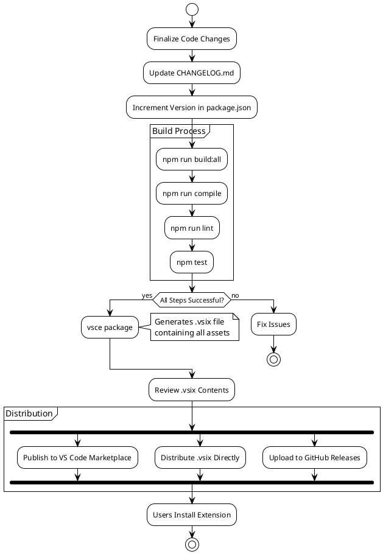

---

## Future Enhancements

### Planned Features

1. **Voice Command Integration**: Add voice-controlled settings changes
2. **Profile Management**: Save and load custom accessibility profiles
3. **Auto-Adjustment**: Detect time of day and adjust themes automatically
4. **Screen Reader Optimization**: Enhanced ARIA labels and screen reader support
5. **Custom Theme Editor**: Allow users to create their own high-contrast themes
6. **Workspace-Specific Settings**: Different configurations per project
7. **Telemetry (Opt-in)**: Collect anonymous usage data to improve accessibility

### Architecture Evolution

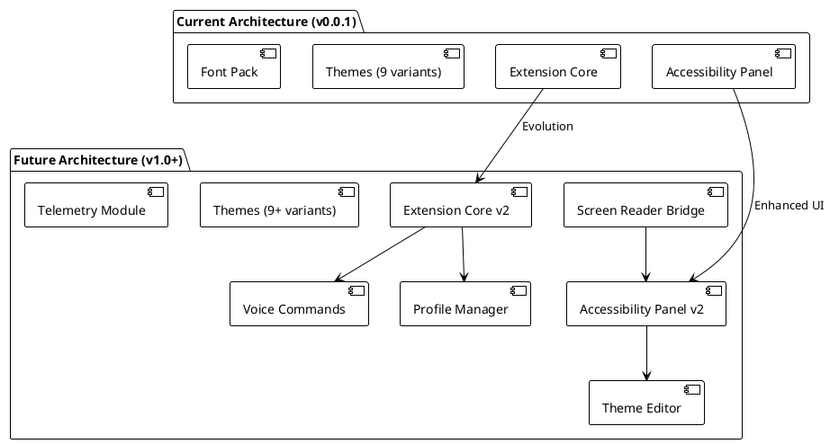

---

## Conclusion

The **Low Vision Accessibility Extension** demonstrates a comprehensive approach to building accessible developer tools. Key achievements include:

✅ **Modular Architecture**: Themes, fonts, and settings are independently maintainable  
✅ **Automated Build Pipeline**: Submodule-based asset generation  
✅ **Robust State Management**: Singleton pattern with debounced updates  
✅ **User-Friendly Design**: One-click recommended settings and reset functionality  
✅ **Seamless Integration**: Uses VS Code APIs for native look and feel  

This documentation provides a complete reference for understanding, maintaining, and extending the extension's functionality.

---

## Appendix: Key Files Reference

| File Path | Purpose | Lines of Code |
|-----------|---------|---------------|
| `src/extension.ts` | Extension activation and command handlers | ~120 |
| `src/panel/AccessibilityPanel.ts` | Webview-based settings panel | ~650 |
| `scripts/build-github-theme.js` | Theme build automation | ~50 |
| `scripts/build-fonts.js` | Font copy automation | ~35 |
| `package.json` | Extension manifest and configuration | ~80 |
| `tsconfig.json` | TypeScript compiler configuration | ~20 |
| `.github/copilot-instructions.md` | AI assistant guidance | ~400 |

**Total Extension Code**: ~1,355 lines (excluding submodules and generated files)

---

**Document Version**: 1.0  
**Last Updated**: October 23, 2025  
**Author**: Development Team  
**License**: MIT (or as specified in project root)
